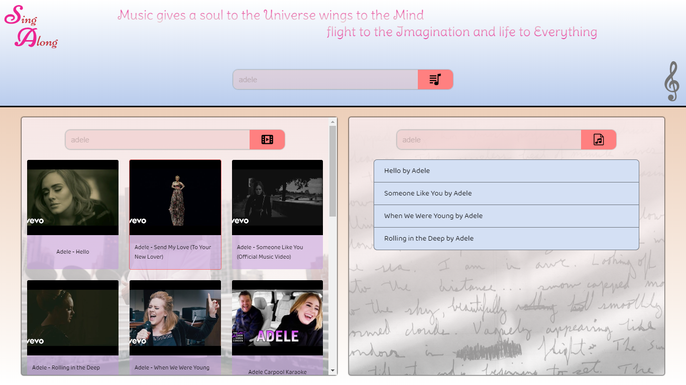
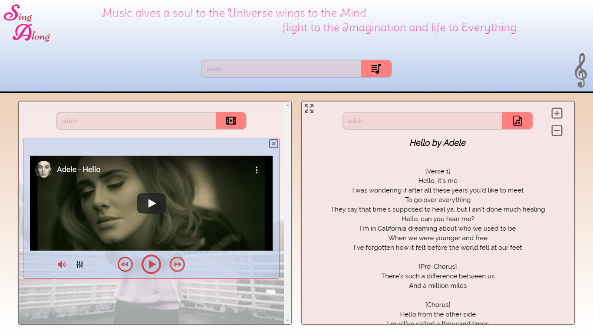
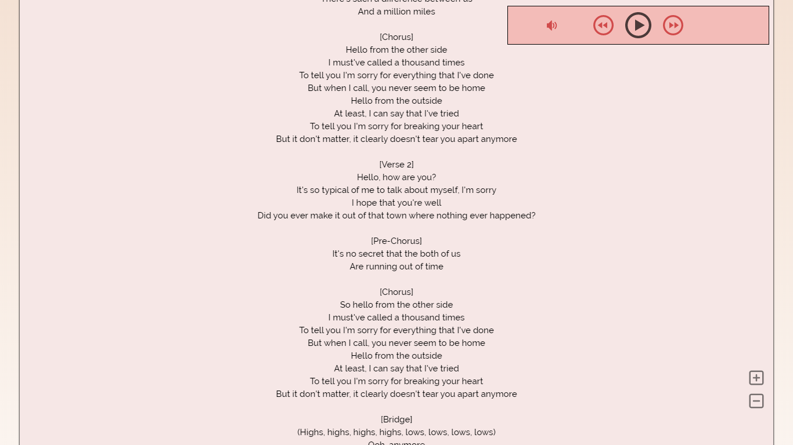

# SingAlong

is a Web-based music-App built with Angular 9.
For those who enjoy learning songs lyrics by heart. This app is for you.
It is specifically designed to make it faster to find your favorite songs and their corresponding lyrics, and start singing along without missing a word.

### Implemented Features & Techniques :

* Lyrics are fetched from Canarado Lyrics API [link](https://rapidapi.com/canarado/api/canarado-lyrics).
* YouTube Data API is used to fetch youtube videos (songs). [link](https://developers.google.com/youtube/v3/docs/). 
* YouTube Iframe player API is used to display and manipulate the videos programmatically. [link](https://developers.google.com/youtube/iframe_api_reference). 
* CSS and Angular Animation is used for smoother transition between UI states.
* Angular Services are used for proper state management. 
* App is fully responsive and optimized for use on mobile devices.

==> Click [here](https://sing-along999.web.app/) to check it out.

__________________________________________________________________

__________________________________________________________________

__________________________________________________________________

